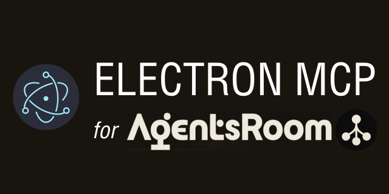

<p align="center">
  
</p>

<p align="center">
  <a href="https://www.npmjs.com/package/electron-mcp-server"></a>
  <a href="LICENSE"></a>
  <a href="https://agentsroom.dev"></a>
</p>

<p align="center">
  <strong>Give your AI agents full control over any Electron app. Zero changes to your existing code.</strong>
</p>

---

## 🤖 What is AgentsRoom?

[AgentsRoom](https://agentsroom.dev) is a macOS command center for running multiple Claude AI agents in parallel on your own projects. Think of it as a desktop IDE where every tab is an autonomous AI agent that can read, write, build, and test your codebase, all at the same time.

Each agent in AgentsRoom can be connected to **MCP servers** that extend its capabilities beyond the file system. This package is the MCP server that lets those agents take direct control of any running Electron application.

[Download AgentsRoom](https://agentsroom.dev/download) — free, macOS, no subscription required.

---

## 🔌 What is MCP?

**Model Context Protocol** (MCP) is an open standard introduced by Anthropic that defines how AI models communicate with external tools and environments. Instead of training a model to "know" every API, MCP lets you expose any capability as a structured set of tools the model can call: a database, a browser, a file system, a running app.

An MCP server is a small process that declares typed tools (name, description, input schema), receives call requests from the AI, executes the action, and returns a structured result.

This package is an MCP server for Electron apps. The AI calls `click`, `type`, `screenshot`, `assert_visible` and this server executes them against the real renderer via Chrome DevTools Protocol.

---

## ⚡ Why Electron MCP?

Modern AI agents are great at reasoning and writing code. The missing piece is **closing the feedback loop**: the agent writes a change, rebuilds the app, then needs to *see* whether it worked. Without direct access to the running UI, agents have to guess.

Electron MCP closes that loop:

- **No wrapper code needed.** Your app just needs `--remote-debugging-port=N` at launch. That's it.
- **Real interactions.** Click, type, scroll, navigate — the same events a user would fire, not simulated DOM mutations.
- **Visual verification.** The agent takes a screenshot after every action, asserts that the right element appeared, and reads the renderer's console logs if something went wrong.
- **Multi-window support.** Electron apps often open several BrowserWindows. The agent can list all targets and switch between them freely.

### Why it's especially powerful with AgentsRoom

AgentsRoom already manages agent lifecycles, parallel sessions, and project context. Adding Electron MCP means your agents can:

- **Write a feature and immediately test it** in the running app, in the same turn, without leaving AgentsRoom.
- **Run visual regression checks** by screenshotting before and after a change.
- **Debug renderer errors** by reading console logs directly, without opening DevTools manually.
- **Automate end-to-end workflows** across multiple windows of the same app.

The result is a tight loop between code generation and UI validation that would otherwise require a separate test framework, a CI environment, and manual review.

---

## 🚀 Get started in 30 seconds

**Step 1.** Launch your Electron app with the debug port:

```bash
electron . --remote-debugging-port=9223
```

**Step 2.** Paste this prompt into your AgentsRoom agent:

```
Add electron-mcp-server to my project MCP config.
My Electron app runs on debug port 9223.
Once it's set up, take a screenshot to confirm the connection works.
```

That's it. The agent will add the server to your `.mcp.json`, connect to the running app, and confirm it's working with a live screenshot.

---

## 👁️ Tool reference

### Observe

| Tool | What it does |
|---|---|
| `screenshot` | PNG/JPEG of the viewport, a specific element, or full page |
| `dom_query` | Query the DOM with CSS: returns attrs, text, rect, visibility |
| `console_logs` | Recent renderer console output, filterable by level |
| `get_state` | Viewport size, user agent, document ready state |
| `get_route` | Current `location` (href, pathname, search, hash) |
| `list_targets` | All CDP targets exposed by the app (windows, workers) |
| `switch_target` | Re-attach to a different BrowserWindow |

### 🖱️ Interact

| Tool | What it does |
|---|---|
| `click` | Click any element, supports multi-click and modifier keys |
| `type` | Focus and type into an input or contenteditable |
| `press_key` | Dispatch a key combo (`Meta+K`, `Control+Shift+P`, ...) |
| `navigate` | Hard-navigate the renderer to a URL |
| `scroll` | Scroll an element into view or scroll by delta |
| `wait_for_selector` | Poll until a selector appears (or disappears) |

### Assert

| Tool | What it does |
|---|---|
| `assert_text` | textContent equals / contains / matches regex |
| `assert_visible` | Element is visible (or absent with `invert: true`) |
| `assert_count` | `querySelectorAll` count is equal / atLeast / atMost |
| `assert_route` | Current URL field matches expected value |

### Selector syntax

```
css=.sidebar > .item      # explicit CSS
testid=submit-button      # [data-testid="submit-button"]
text=Save changes         # first element whose text matches exactly
.sidebar > .item          # bare string treated as CSS
```

---

## CLI options

```
electron-mcp-server --port <n> [options]

  --host <h>        Hostname to attach to (default: 127.0.0.1)
  --target <id>     Specific CDP target id (default: first non-blank page)
  --wait <ms>       Wait for target up to N ms (default: 10000)
  --lazy            Defer connection until first tool call
  --name <s>        Server name advertised over MCP

  ELECTRON_MCP_LOG_LEVEL=debug   verbose logs to stderr
```

---

## Programmatic use

Embed the server in your own process and register custom tools alongside the built-in catalog:

```ts
import { runServer, defineExtension, z } from "electron-mcp-server";

const myExt = defineExtension({
  name: "my-app",
  version: "1.0.0",
  tools: [
    {
      name: "open_settings",
      description: "Open the app settings panel.",
      inputSchema: z.object({}),
      async handler(_args, ctx) {
        await ctx.cdp.evaluate(`window.__app.openSettings()`);
        return { opened: true };
      },
    },
  ],
});

const handle = await runServer({ port: 9223, extensions: [myExt] });
// handle.stop() to shut down cleanly
```

---

## How it works

The server connects to your app's CDP endpoint and exposes every action as a typed MCP tool. The AI never touches the Electron process directly: it only calls tools, and the server translates them into CDP commands against the running renderer.

```
AI agent
  └── MCP tool call (e.g. click { selector: "text=Save" })
        └── electron-mcp-server
              └── Chrome DevTools Protocol
                    └── Electron renderer (your app)
```

No Playwright runtime, no bundled browser, no modifications to your app. Just a 60 KB CDP client that attaches to what's already running.

---

## Requirements

- Node.js 18+
- An Electron app launched with `--remote-debugging-port`
- An MCP-compatible client ([AgentsRoom](https://agentsroom.dev), Claude Code, Cursor, ...)

---

## Links

- **AgentsRoom**: [agentsroom.dev](https://agentsroom.dev)
- **Download AgentsRoom**: [agentsroom.dev/download](https://agentsroom.dev/download)
- **Issues**: [GitHub Issues](https://github.com/AgentsRoomDev/electron-mcp-for-agentsroom/issues)

---

## License

MIT — see [LICENSE](LICENSE).
